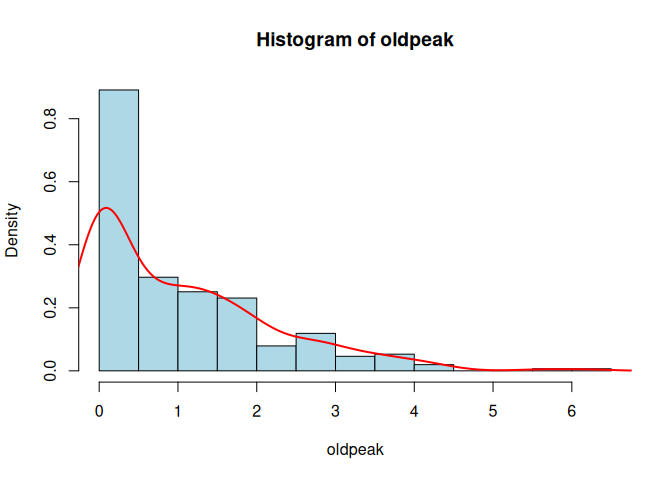
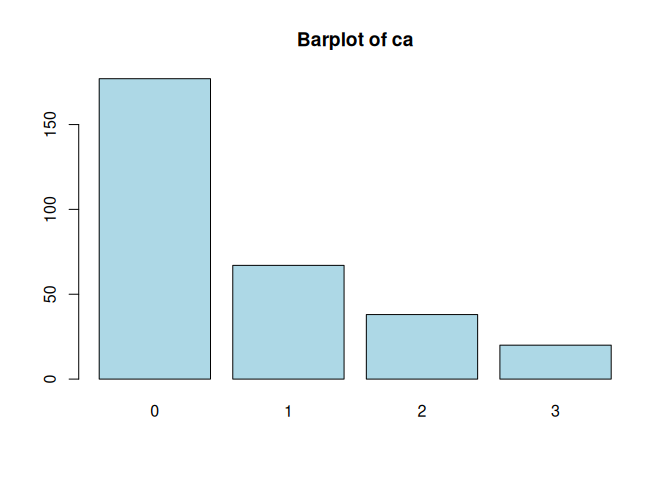
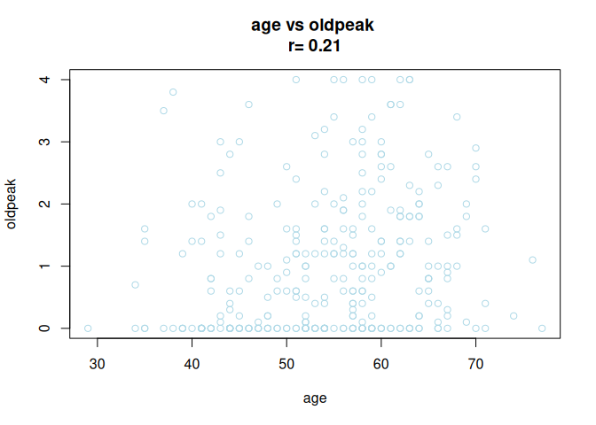

# Load Necessary Libraries


``` r
library(readr)
library(dplyr)
library(mice)
library(corrplot)
library(ggplot2)
library(gridExtra)
library(readxl)
library(openxlsx)
library(tidyr)
library(ggthemes)
library(cowplot)
library(grid)
library(gridExtra)
library(RColorBrewer)
library(stats)
library(ComplexHeatmap)
library(circlize)
```

# Analysis of the Heart Disease Dataset

::: {style="text-align: justify; color: #9b9b9b; background-color: white;"}
Load the data from [here](https://raw.githubusercontent.com/jpinero/DMI_2021/main/datasets/heart_disease_dataset.csv), and the description is [here](https://raw.githubusercontent.com/jpinero/DMI_2021/main/datasets/heart_disease_description.txt).
The original dataset comes from [here](https://archive.ics.uci.edu/ml/datasets/Heart+Disease) and corresponds to the [processed cleveland data](https://archive.ics.uci.edu/ml/machine-learning-databases/heart-disease/processed.cleveland.data).
:::

## Perform an EDA on the dataset


``` r
# See table separating item
lines <- readLines("data/heart_disease_dataset.csv", n = 10)
lines 
```

```
##  [1] "age sex cp trestbps chol fbs restecg thalach exang oldpeak slope ca thal num patient_id"
##  [2] "63 1 1 145 233 1 2 150 0 2.3 3 0 6 0 1"                                                 
##  [3] "67 1 4 160 286 0 2 108 1 1.5 2 3 3 2 2"                                                 
##  [4] "67 1 4 120 229 0 2 129 1 2.6 2 2 7 1 3"                                                 
##  [5] "37 1 3 130 250 0 0 187 0 3.5 3 0 3 0 4"                                                 
##  [6] "41 0 2 130 204 0 2 172 0 1.4 1 0 3 0 5"                                                 
##  [7] "56 1 2 120 236 0 0 178 0 0.8 1 0 3 0 6"                                                 
##  [8] "62 0 4 140 268 0 2 160 0 3.6 3 2 3 3 7"                                                 
##  [9] "57 0 4 120 354 0 0 163 1 0.6 1 0 3 0 8"                                                 
## [10] "63 1 4 130 254 0 2 147 0 1.4 2 1 7 2 9"
```

``` r
# Read the table
dataset <- read_table("data/heart_disease_dataset.csv")
```

```
## 
## ── Column specification ────────────────────────────────────────────────────────
## cols(
##   age = col_double(),
##   sex = col_double(),
##   cp = col_double(),
##   trestbps = col_double(),
##   chol = col_double(),
##   fbs = col_double(),
##   restecg = col_double(),
##   thalach = col_double(),
##   exang = col_double(),
##   oldpeak = col_double(),
##   slope = col_double(),
##   ca = col_character(),
##   thal = col_character(),
##   num = col_double(),
##   patient_id = col_double()
## )
```

``` r
View(dataset)

# Summary of the data
summarytools::dfSummary(dataset, stats = c("mean", "sd", "median", "iqr")) %>% 
  print(method = "render")
```

```{=html}
<div class="container st-container">
<h3>Data Frame Summary</h3>
<h4>dataset</h4>
<strong>Dimensions</strong>: 303 x 15
  <br/><strong>Duplicates</strong>: 0
<br/>
<table class="table table-striped table-bordered st-table st-table-striped st-table-bordered st-multiline ">
  <thead>
    <tr>
      <th align="center" class="st-protect-top-border"><strong>No</strong></th>
      <th align="center" class="st-protect-top-border"><strong>Variable</strong></th>
      <th align="center" class="st-protect-top-border"><strong>Stats / Values</strong></th>
      <th align="center" class="st-protect-top-border"><strong>Freqs (% of Valid)</strong></th>
      <th align="center" class="st-protect-top-border"><strong>Graph</strong></th>
      <th align="center" class="st-protect-top-border"><strong>Valid</strong></th>
      <th align="center" class="st-protect-top-border"><strong>Missing</strong></th>
    </tr>
  </thead>
  <tbody>
    <tr>
      <td align="center">1</td>
      <td align="left">age
[numeric]</td>
      <td align="left" style="padding:8;vertical-align:middle"><table style="border-collapse:collapse;border:none;margin:0"><tr style="background-color:transparent"><td style="padding:0;margin:0;border:0" align="left">Mean (sd) : 54.4 (9)</td></tr><tr style="background-color:transparent"><td style="padding:0;margin:0;border:0" align="left">min &le; med &le; max:</td></tr><tr style="background-color:transparent"><td style="padding:0;margin:0;border:0" align="left">29 &le; 56 &le; 77</td></tr><tr style="background-color:transparent"><td style="padding:0;margin:0;border:0" align="left">IQR (CV) : 13 (0.2)</td></tr></table></td>
      <td align="left" style="vertical-align:middle">41 distinct values</td>
      <td align="left" style="vertical-align:middle;padding:0;background-color:transparent;"></td>
      <td align="center">303
(100.0%)</td>
      <td align="center">0
(0.0%)</td>
    </tr>
    <tr>
      <td align="center">2</td>
      <td align="left">sex
[numeric]</td>
      <td align="left" style="padding:8;vertical-align:middle"><table style="border-collapse:collapse;border:none;margin:0"><tr style="background-color:transparent"><td style="padding:0;margin:0;border:0" align="left">Min  : 0</td></tr><tr style="background-color:transparent"><td style="padding:0;margin:0;border:0" align="left">Mean : 0.7</td></tr><tr style="background-color:transparent"><td style="padding:0;margin:0;border:0" align="left">Max  : 1</td></tr></table></td>
      <td align="left" style="padding:0;vertical-align:middle"><table style="border-collapse:collapse;border:none;margin:0"><tr style="background-color:transparent"><td style="padding:0 2px 0 7px;margin:0;border:0" align="right">0</td><td style="padding:0 2px;border:0;" align="left">:</td><td style="padding:0 4px 0 6px;margin:0;border:0" align="right">97</td><td style="padding:0;border:0" align="left">(</td><td style="padding:0 2px;margin:0;border:0" align="right">32.0%</td><td style="padding:0 4px 0 0;border:0" align="left">)</td></tr><tr style="background-color:transparent"><td style="padding:0 2px 0 7px;margin:0;border:0" align="right">1</td><td style="padding:0 2px;border:0;" align="left">:</td><td style="padding:0 4px 0 6px;margin:0;border:0" align="right">206</td><td style="padding:0;border:0" align="left">(</td><td style="padding:0 2px;margin:0;border:0" align="right">68.0%</td><td style="padding:0 4px 0 0;border:0" align="left">)</td></tr></table></td>
      <td align="left" style="vertical-align:middle;padding:0;background-color:transparent;"></td>
      <td align="center">303
(100.0%)</td>
      <td align="center">0
(0.0%)</td>
    </tr>
    <tr>
      <td align="center">3</td>
      <td align="left">cp
[numeric]</td>
      <td align="left" style="padding:8;vertical-align:middle"><table style="border-collapse:collapse;border:none;margin:0"><tr style="background-color:transparent"><td style="padding:0;margin:0;border:0" align="left">Mean (sd) : 3.2 (1)</td></tr><tr style="background-color:transparent"><td style="padding:0;margin:0;border:0" align="left">min &le; med &le; max:</td></tr><tr style="background-color:transparent"><td style="padding:0;margin:0;border:0" align="left">1 &le; 3 &le; 4</td></tr><tr style="background-color:transparent"><td style="padding:0;margin:0;border:0" align="left">IQR (CV) : 1 (0.3)</td></tr></table></td>
      <td align="left" style="padding:0;vertical-align:middle"><table style="border-collapse:collapse;border:none;margin:0"><tr style="background-color:transparent"><td style="padding:0 2px 0 7px;margin:0;border:0" align="right">1</td><td style="padding:0 2px;border:0;" align="left">:</td><td style="padding:0 4px 0 6px;margin:0;border:0" align="right">23</td><td style="padding:0;border:0" align="left">(</td><td style="padding:0 2px;margin:0;border:0" align="right">7.6%</td><td style="padding:0 4px 0 0;border:0" align="left">)</td></tr><tr style="background-color:transparent"><td style="padding:0 2px 0 7px;margin:0;border:0" align="right">2</td><td style="padding:0 2px;border:0;" align="left">:</td><td style="padding:0 4px 0 6px;margin:0;border:0" align="right">50</td><td style="padding:0;border:0" align="left">(</td><td style="padding:0 2px;margin:0;border:0" align="right">16.5%</td><td style="padding:0 4px 0 0;border:0" align="left">)</td></tr><tr style="background-color:transparent"><td style="padding:0 2px 0 7px;margin:0;border:0" align="right">3</td><td style="padding:0 2px;border:0;" align="left">:</td><td style="padding:0 4px 0 6px;margin:0;border:0" align="right">86</td><td style="padding:0;border:0" align="left">(</td><td style="padding:0 2px;margin:0;border:0" align="right">28.4%</td><td style="padding:0 4px 0 0;border:0" align="left">)</td></tr><tr style="background-color:transparent"><td style="padding:0 2px 0 7px;margin:0;border:0" align="right">4</td><td style="padding:0 2px;border:0;" align="left">:</td><td style="padding:0 4px 0 6px;margin:0;border:0" align="right">144</td><td style="padding:0;border:0" align="left">(</td><td style="padding:0 2px;margin:0;border:0" align="right">47.5%</td><td style="padding:0 4px 0 0;border:0" align="left">)</td></tr></table></td>
      <td align="left" style="vertical-align:middle;padding:0;background-color:transparent;"></td>
      <td align="center">303
(100.0%)</td>
      <td align="center">0
(0.0%)</td>
    </tr>
    <tr>
      <td align="center">4</td>
      <td align="left">trestbps
[numeric]</td>
      <td align="left" style="padding:8;vertical-align:middle"><table style="border-collapse:collapse;border:none;margin:0"><tr style="background-color:transparent"><td style="padding:0;margin:0;border:0" align="left">Mean (sd) : 131.7 (17.6)</td></tr><tr style="background-color:transparent"><td style="padding:0;margin:0;border:0" align="left">min &le; med &le; max:</td></tr><tr style="background-color:transparent"><td style="padding:0;margin:0;border:0" align="left">94 &le; 130 &le; 200</td></tr><tr style="background-color:transparent"><td style="padding:0;margin:0;border:0" align="left">IQR (CV) : 20 (0.1)</td></tr></table></td>
      <td align="left" style="vertical-align:middle">50 distinct values</td>
      <td align="left" style="vertical-align:middle;padding:0;background-color:transparent;"></td>
      <td align="center">303
(100.0%)</td>
      <td align="center">0
(0.0%)</td>
    </tr>
    <tr>
      <td align="center">5</td>
      <td align="left">chol
[numeric]</td>
      <td align="left" style="padding:8;vertical-align:middle"><table style="border-collapse:collapse;border:none;margin:0"><tr style="background-color:transparent"><td style="padding:0;margin:0;border:0" align="left">Mean (sd) : 246.7 (51.8)</td></tr><tr style="background-color:transparent"><td style="padding:0;margin:0;border:0" align="left">min &le; med &le; max:</td></tr><tr style="background-color:transparent"><td style="padding:0;margin:0;border:0" align="left">126 &le; 241 &le; 564</td></tr><tr style="background-color:transparent"><td style="padding:0;margin:0;border:0" align="left">IQR (CV) : 64 (0.2)</td></tr></table></td>
      <td align="left" style="vertical-align:middle">152 distinct values</td>
      <td align="left" style="vertical-align:middle;padding:0;background-color:transparent;"></td>
      <td align="center">303
(100.0%)</td>
      <td align="center">0
(0.0%)</td>
    </tr>
    <tr>
      <td align="center">6</td>
      <td align="left">fbs
[numeric]</td>
      <td align="left" style="padding:8;vertical-align:middle"><table style="border-collapse:collapse;border:none;margin:0"><tr style="background-color:transparent"><td style="padding:0;margin:0;border:0" align="left">Min  : 0</td></tr><tr style="background-color:transparent"><td style="padding:0;margin:0;border:0" align="left">Mean : 0.1</td></tr><tr style="background-color:transparent"><td style="padding:0;margin:0;border:0" align="left">Max  : 1</td></tr></table></td>
      <td align="left" style="padding:0;vertical-align:middle"><table style="border-collapse:collapse;border:none;margin:0"><tr style="background-color:transparent"><td style="padding:0 2px 0 7px;margin:0;border:0" align="right">0</td><td style="padding:0 2px;border:0;" align="left">:</td><td style="padding:0 4px 0 6px;margin:0;border:0" align="right">258</td><td style="padding:0;border:0" align="left">(</td><td style="padding:0 2px;margin:0;border:0" align="right">85.1%</td><td style="padding:0 4px 0 0;border:0" align="left">)</td></tr><tr style="background-color:transparent"><td style="padding:0 2px 0 7px;margin:0;border:0" align="right">1</td><td style="padding:0 2px;border:0;" align="left">:</td><td style="padding:0 4px 0 6px;margin:0;border:0" align="right">45</td><td style="padding:0;border:0" align="left">(</td><td style="padding:0 2px;margin:0;border:0" align="right">14.9%</td><td style="padding:0 4px 0 0;border:0" align="left">)</td></tr></table></td>
      <td align="left" style="vertical-align:middle;padding:0;background-color:transparent;"></td>
      <td align="center">303
(100.0%)</td>
      <td align="center">0
(0.0%)</td>
    </tr>
    <tr>
      <td align="center">7</td>
      <td align="left">restecg
[numeric]</td>
      <td align="left" style="padding:8;vertical-align:middle"><table style="border-collapse:collapse;border:none;margin:0"><tr style="background-color:transparent"><td style="padding:0;margin:0;border:0" align="left">Mean (sd) : 1 (1)</td></tr><tr style="background-color:transparent"><td style="padding:0;margin:0;border:0" align="left">min &le; med &le; max:</td></tr><tr style="background-color:transparent"><td style="padding:0;margin:0;border:0" align="left">0 &le; 1 &le; 2</td></tr><tr style="background-color:transparent"><td style="padding:0;margin:0;border:0" align="left">IQR (CV) : 2 (1)</td></tr></table></td>
      <td align="left" style="padding:0;vertical-align:middle"><table style="border-collapse:collapse;border:none;margin:0"><tr style="background-color:transparent"><td style="padding:0 2px 0 7px;margin:0;border:0" align="right">0</td><td style="padding:0 2px;border:0;" align="left">:</td><td style="padding:0 4px 0 6px;margin:0;border:0" align="right">151</td><td style="padding:0;border:0" align="left">(</td><td style="padding:0 2px;margin:0;border:0" align="right">49.8%</td><td style="padding:0 4px 0 0;border:0" align="left">)</td></tr><tr style="background-color:transparent"><td style="padding:0 2px 0 7px;margin:0;border:0" align="right">1</td><td style="padding:0 2px;border:0;" align="left">:</td><td style="padding:0 4px 0 6px;margin:0;border:0" align="right">4</td><td style="padding:0;border:0" align="left">(</td><td style="padding:0 2px;margin:0;border:0" align="right">1.3%</td><td style="padding:0 4px 0 0;border:0" align="left">)</td></tr><tr style="background-color:transparent"><td style="padding:0 2px 0 7px;margin:0;border:0" align="right">2</td><td style="padding:0 2px;border:0;" align="left">:</td><td style="padding:0 4px 0 6px;margin:0;border:0" align="right">148</td><td style="padding:0;border:0" align="left">(</td><td style="padding:0 2px;margin:0;border:0" align="right">48.8%</td><td style="padding:0 4px 0 0;border:0" align="left">)</td></tr></table></td>
      <td align="left" style="vertical-align:middle;padding:0;background-color:transparent;"></td>
      <td align="center">303
(100.0%)</td>
      <td align="center">0
(0.0%)</td>
    </tr>
    <tr>
      <td align="center">8</td>
      <td align="left">thalach
[numeric]</td>
      <td align="left" style="padding:8;vertical-align:middle"><table style="border-collapse:collapse;border:none;margin:0"><tr style="background-color:transparent"><td style="padding:0;margin:0;border:0" align="left">Mean (sd) : 149.6 (22.9)</td></tr><tr style="background-color:transparent"><td style="padding:0;margin:0;border:0" align="left">min &le; med &le; max:</td></tr><tr style="background-color:transparent"><td style="padding:0;margin:0;border:0" align="left">71 &le; 153 &le; 202</td></tr><tr style="background-color:transparent"><td style="padding:0;margin:0;border:0" align="left">IQR (CV) : 32.5 (0.2)</td></tr></table></td>
      <td align="left" style="vertical-align:middle">91 distinct values</td>
      <td align="left" style="vertical-align:middle;padding:0;background-color:transparent;"></td>
      <td align="center">303
(100.0%)</td>
      <td align="center">0
(0.0%)</td>
    </tr>
    <tr>
      <td align="center">9</td>
      <td align="left">exang
[numeric]</td>
      <td align="left" style="padding:8;vertical-align:middle"><table style="border-collapse:collapse;border:none;margin:0"><tr style="background-color:transparent"><td style="padding:0;margin:0;border:0" align="left">Min  : 0</td></tr><tr style="background-color:transparent"><td style="padding:0;margin:0;border:0" align="left">Mean : 0.3</td></tr><tr style="background-color:transparent"><td style="padding:0;margin:0;border:0" align="left">Max  : 1</td></tr></table></td>
      <td align="left" style="padding:0;vertical-align:middle"><table style="border-collapse:collapse;border:none;margin:0"><tr style="background-color:transparent"><td style="padding:0 2px 0 7px;margin:0;border:0" align="right">0</td><td style="padding:0 2px;border:0;" align="left">:</td><td style="padding:0 4px 0 6px;margin:0;border:0" align="right">204</td><td style="padding:0;border:0" align="left">(</td><td style="padding:0 2px;margin:0;border:0" align="right">67.3%</td><td style="padding:0 4px 0 0;border:0" align="left">)</td></tr><tr style="background-color:transparent"><td style="padding:0 2px 0 7px;margin:0;border:0" align="right">1</td><td style="padding:0 2px;border:0;" align="left">:</td><td style="padding:0 4px 0 6px;margin:0;border:0" align="right">99</td><td style="padding:0;border:0" align="left">(</td><td style="padding:0 2px;margin:0;border:0" align="right">32.7%</td><td style="padding:0 4px 0 0;border:0" align="left">)</td></tr></table></td>
      <td align="left" style="vertical-align:middle;padding:0;background-color:transparent;"></td>
      <td align="center">303
(100.0%)</td>
      <td align="center">0
(0.0%)</td>
    </tr>
    <tr>
      <td align="center">10</td>
      <td align="left">oldpeak
[numeric]</td>
      <td align="left" style="padding:8;vertical-align:middle"><table style="border-collapse:collapse;border:none;margin:0"><tr style="background-color:transparent"><td style="padding:0;margin:0;border:0" align="left">Mean (sd) : 1 (1.2)</td></tr><tr style="background-color:transparent"><td style="padding:0;margin:0;border:0" align="left">min &le; med &le; max:</td></tr><tr style="background-color:transparent"><td style="padding:0;margin:0;border:0" align="left">0 &le; 0.8 &le; 6.2</td></tr><tr style="background-color:transparent"><td style="padding:0;margin:0;border:0" align="left">IQR (CV) : 1.6 (1.1)</td></tr></table></td>
      <td align="left" style="vertical-align:middle">40 distinct values</td>
      <td align="left" style="vertical-align:middle;padding:0;background-color:transparent;"></td>
      <td align="center">303
(100.0%)</td>
      <td align="center">0
(0.0%)</td>
    </tr>
    <tr>
      <td align="center">11</td>
      <td align="left">slope
[numeric]</td>
      <td align="left" style="padding:8;vertical-align:middle"><table style="border-collapse:collapse;border:none;margin:0"><tr style="background-color:transparent"><td style="padding:0;margin:0;border:0" align="left">Mean (sd) : 1.6 (0.6)</td></tr><tr style="background-color:transparent"><td style="padding:0;margin:0;border:0" align="left">min &le; med &le; max:</td></tr><tr style="background-color:transparent"><td style="padding:0;margin:0;border:0" align="left">1 &le; 2 &le; 3</td></tr><tr style="background-color:transparent"><td style="padding:0;margin:0;border:0" align="left">IQR (CV) : 1 (0.4)</td></tr></table></td>
      <td align="left" style="padding:0;vertical-align:middle"><table style="border-collapse:collapse;border:none;margin:0"><tr style="background-color:transparent"><td style="padding:0 2px 0 7px;margin:0;border:0" align="right">1</td><td style="padding:0 2px;border:0;" align="left">:</td><td style="padding:0 4px 0 6px;margin:0;border:0" align="right">142</td><td style="padding:0;border:0" align="left">(</td><td style="padding:0 2px;margin:0;border:0" align="right">46.9%</td><td style="padding:0 4px 0 0;border:0" align="left">)</td></tr><tr style="background-color:transparent"><td style="padding:0 2px 0 7px;margin:0;border:0" align="right">2</td><td style="padding:0 2px;border:0;" align="left">:</td><td style="padding:0 4px 0 6px;margin:0;border:0" align="right">140</td><td style="padding:0;border:0" align="left">(</td><td style="padding:0 2px;margin:0;border:0" align="right">46.2%</td><td style="padding:0 4px 0 0;border:0" align="left">)</td></tr><tr style="background-color:transparent"><td style="padding:0 2px 0 7px;margin:0;border:0" align="right">3</td><td style="padding:0 2px;border:0;" align="left">:</td><td style="padding:0 4px 0 6px;margin:0;border:0" align="right">21</td><td style="padding:0;border:0" align="left">(</td><td style="padding:0 2px;margin:0;border:0" align="right">6.9%</td><td style="padding:0 4px 0 0;border:0" align="left">)</td></tr></table></td>
      <td align="left" style="vertical-align:middle;padding:0;background-color:transparent;"></td>
      <td align="center">303
(100.0%)</td>
      <td align="center">0
(0.0%)</td>
    </tr>
    <tr>
      <td align="center">12</td>
      <td align="left">ca
[character]</td>
      <td align="left" style="padding:8;vertical-align:middle"><table style="border-collapse:collapse;border:none;margin:0"><tr style="background-color:transparent"><td style="padding:0;margin:0;border:0" align="left">1. ?</td></tr><tr style="background-color:transparent"><td style="padding:0;margin:0;border:0" align="left">2. 0</td></tr><tr style="background-color:transparent"><td style="padding:0;margin:0;border:0" align="left">3. 1</td></tr><tr style="background-color:transparent"><td style="padding:0;margin:0;border:0" align="left">4. 2</td></tr><tr style="background-color:transparent"><td style="padding:0;margin:0;border:0" align="left">5. 3</td></tr></table></td>
      <td align="left" style="padding:0;vertical-align:middle"><table style="border-collapse:collapse;border:none;margin:0"><tr style="background-color:transparent"><td style="padding:0 5px 0 7px;margin:0;border:0" align="right">4</td><td style="padding:0 2px 0 0;border:0;" align="left">(</td><td style="padding:0;border:0" align="right">1.3%</td><td style="padding:0 4px 0 2px;border:0" align="left">)</td></tr><tr style="background-color:transparent"><td style="padding:0 5px 0 7px;margin:0;border:0" align="right">176</td><td style="padding:0 2px 0 0;border:0;" align="left">(</td><td style="padding:0;border:0" align="right">58.1%</td><td style="padding:0 4px 0 2px;border:0" align="left">)</td></tr><tr style="background-color:transparent"><td style="padding:0 5px 0 7px;margin:0;border:0" align="right">65</td><td style="padding:0 2px 0 0;border:0;" align="left">(</td><td style="padding:0;border:0" align="right">21.5%</td><td style="padding:0 4px 0 2px;border:0" align="left">)</td></tr><tr style="background-color:transparent"><td style="padding:0 5px 0 7px;margin:0;border:0" align="right">38</td><td style="padding:0 2px 0 0;border:0;" align="left">(</td><td style="padding:0;border:0" align="right">12.5%</td><td style="padding:0 4px 0 2px;border:0" align="left">)</td></tr><tr style="background-color:transparent"><td style="padding:0 5px 0 7px;margin:0;border:0" align="right">20</td><td style="padding:0 2px 0 0;border:0;" align="left">(</td><td style="padding:0;border:0" align="right">6.6%</td><td style="padding:0 4px 0 2px;border:0" align="left">)</td></tr></table></td>
      <td align="left" style="vertical-align:middle;padding:0;background-color:transparent;"></td>
      <td align="center">303
(100.0%)</td>
      <td align="center">0
(0.0%)</td>
    </tr>
    <tr>
      <td align="center">13</td>
      <td align="left">thal
[character]</td>
      <td align="left" style="padding:8;vertical-align:middle"><table style="border-collapse:collapse;border:none;margin:0"><tr style="background-color:transparent"><td style="padding:0;margin:0;border:0" align="left">1. ?</td></tr><tr style="background-color:transparent"><td style="padding:0;margin:0;border:0" align="left">2. 3</td></tr><tr style="background-color:transparent"><td style="padding:0;margin:0;border:0" align="left">3. 6</td></tr><tr style="background-color:transparent"><td style="padding:0;margin:0;border:0" align="left">4. 7</td></tr></table></td>
      <td align="left" style="padding:0;vertical-align:middle"><table style="border-collapse:collapse;border:none;margin:0"><tr style="background-color:transparent"><td style="padding:0 5px 0 7px;margin:0;border:0" align="right">2</td><td style="padding:0 2px 0 0;border:0;" align="left">(</td><td style="padding:0;border:0" align="right">0.7%</td><td style="padding:0 4px 0 2px;border:0" align="left">)</td></tr><tr style="background-color:transparent"><td style="padding:0 5px 0 7px;margin:0;border:0" align="right">166</td><td style="padding:0 2px 0 0;border:0;" align="left">(</td><td style="padding:0;border:0" align="right">54.8%</td><td style="padding:0 4px 0 2px;border:0" align="left">)</td></tr><tr style="background-color:transparent"><td style="padding:0 5px 0 7px;margin:0;border:0" align="right">18</td><td style="padding:0 2px 0 0;border:0;" align="left">(</td><td style="padding:0;border:0" align="right">5.9%</td><td style="padding:0 4px 0 2px;border:0" align="left">)</td></tr><tr style="background-color:transparent"><td style="padding:0 5px 0 7px;margin:0;border:0" align="right">117</td><td style="padding:0 2px 0 0;border:0;" align="left">(</td><td style="padding:0;border:0" align="right">38.6%</td><td style="padding:0 4px 0 2px;border:0" align="left">)</td></tr></table></td>
      <td align="left" style="vertical-align:middle;padding:0;background-color:transparent;"></td>
      <td align="center">303
(100.0%)</td>
      <td align="center">0
(0.0%)</td>
    </tr>
    <tr>
      <td align="center">14</td>
      <td align="left">num
[numeric]</td>
      <td align="left" style="padding:8;vertical-align:middle"><table style="border-collapse:collapse;border:none;margin:0"><tr style="background-color:transparent"><td style="padding:0;margin:0;border:0" align="left">Mean (sd) : 0.9 (1.2)</td></tr><tr style="background-color:transparent"><td style="padding:0;margin:0;border:0" align="left">min &le; med &le; max:</td></tr><tr style="background-color:transparent"><td style="padding:0;margin:0;border:0" align="left">0 &le; 0 &le; 4</td></tr><tr style="background-color:transparent"><td style="padding:0;margin:0;border:0" align="left">IQR (CV) : 2 (1.3)</td></tr></table></td>
      <td align="left" style="padding:0;vertical-align:middle"><table style="border-collapse:collapse;border:none;margin:0"><tr style="background-color:transparent"><td style="padding:0 2px 0 7px;margin:0;border:0" align="right">0</td><td style="padding:0 2px;border:0;" align="left">:</td><td style="padding:0 4px 0 6px;margin:0;border:0" align="right">164</td><td style="padding:0;border:0" align="left">(</td><td style="padding:0 2px;margin:0;border:0" align="right">54.1%</td><td style="padding:0 4px 0 0;border:0" align="left">)</td></tr><tr style="background-color:transparent"><td style="padding:0 2px 0 7px;margin:0;border:0" align="right">1</td><td style="padding:0 2px;border:0;" align="left">:</td><td style="padding:0 4px 0 6px;margin:0;border:0" align="right">55</td><td style="padding:0;border:0" align="left">(</td><td style="padding:0 2px;margin:0;border:0" align="right">18.2%</td><td style="padding:0 4px 0 0;border:0" align="left">)</td></tr><tr style="background-color:transparent"><td style="padding:0 2px 0 7px;margin:0;border:0" align="right">2</td><td style="padding:0 2px;border:0;" align="left">:</td><td style="padding:0 4px 0 6px;margin:0;border:0" align="right">36</td><td style="padding:0;border:0" align="left">(</td><td style="padding:0 2px;margin:0;border:0" align="right">11.9%</td><td style="padding:0 4px 0 0;border:0" align="left">)</td></tr><tr style="background-color:transparent"><td style="padding:0 2px 0 7px;margin:0;border:0" align="right">3</td><td style="padding:0 2px;border:0;" align="left">:</td><td style="padding:0 4px 0 6px;margin:0;border:0" align="right">35</td><td style="padding:0;border:0" align="left">(</td><td style="padding:0 2px;margin:0;border:0" align="right">11.6%</td><td style="padding:0 4px 0 0;border:0" align="left">)</td></tr><tr style="background-color:transparent"><td style="padding:0 2px 0 7px;margin:0;border:0" align="right">4</td><td style="padding:0 2px;border:0;" align="left">:</td><td style="padding:0 4px 0 6px;margin:0;border:0" align="right">13</td><td style="padding:0;border:0" align="left">(</td><td style="padding:0 2px;margin:0;border:0" align="right">4.3%</td><td style="padding:0 4px 0 0;border:0" align="left">)</td></tr></table></td>
      <td align="left" style="vertical-align:middle;padding:0;background-color:transparent;"></td>
      <td align="center">303
(100.0%)</td>
      <td align="center">0
(0.0%)</td>
    </tr>
    <tr>
      <td align="center">15</td>
      <td align="left">patient_id
[numeric]</td>
      <td align="left" style="padding:8;vertical-align:middle"><table style="border-collapse:collapse;border:none;margin:0"><tr style="background-color:transparent"><td style="padding:0;margin:0;border:0" align="left">Mean (sd) : 152 (87.6)</td></tr><tr style="background-color:transparent"><td style="padding:0;margin:0;border:0" align="left">min &le; med &le; max:</td></tr><tr style="background-color:transparent"><td style="padding:0;margin:0;border:0" align="left">1 &le; 152 &le; 303</td></tr><tr style="background-color:transparent"><td style="padding:0;margin:0;border:0" align="left">IQR (CV) : 151 (0.6)</td></tr></table></td>
      <td align="left" style="vertical-align:middle">303 distinct values</td>
      <td align="left" style="vertical-align:middle;padding:0;background-color:transparent;"></td>
      <td align="center">303
(100.0%)</td>
      <td align="center">0
(0.0%)</td>
    </tr>
  </tbody>
</table>
<p>Generated by <a href='https://github.com/dcomtois/summarytools'>summarytools</a> 1.0.1 (<a href='https://www.r-project.org/'>R</a> version 4.4.2)<br/>2025-03-20</p>
</div>
```

``` r
# Variable analysis
colnames(dataset)
```

```
##  [1] "age"        "sex"        "cp"         "trestbps"   "chol"      
##  [6] "fbs"        "restecg"    "thalach"    "exang"      "oldpeak"   
## [11] "slope"      "ca"         "thal"       "num"        "patient_id"
```

``` r
## NUMERICAL VAR

# age: age in years
# trestbps: resting blood pressure (in mm Hg on admission to the hospital)
# chol: serum cholestoral in mg/dl
# thalach: maximum heart rate achieved
# oldpeak: T depression induced by exercise relative to rest

## CATEGORICAL VAR

# sex: gender (1 = male; 0 = female)
# cp: chest pain type (1 = typical angina, 2 = atypical angina, 3 = non-anginal pain, 4 = asymptomatic)
# fbs: fasting blood sugar > 120 mg/dl (1 = true; 0 = false)
# restecg: resting electrocardiographic results (0 = normal, 1 = having ST-T wave abnormality, 2 = showing probable or definite left ventricular hypertrophy)
# exang: exercise induced angina (1 = yes; 0 = no)
# slope: the slope of the peak exercise ST segment (1 = upsloping, 2 = flat, 3 = downsloping)
# ca: number of major vessels (0-3) colored by flourosopy
# thal: 3 = normal; 6 = fixed defect; 7 = reversable defect
# num: diagnosis of heart disease (0 = < 50% diameter narrowing, 1 = > 50% diameter narrowing)

# Remove patient_id from the dataset, it was no used as attribute
heart_disease_dataset <- dataset %>%
  dplyr::select(-patient_id)

# Check for duplicates 
heart_disease_dataset[duplicated(heart_disease_dataset), ] # no duplicates found
```

```
## # A tibble: 0 × 14
## # ℹ 14 variables: age <dbl>, sex <dbl>, cp <dbl>, trestbps <dbl>, chol <dbl>,
## #   fbs <dbl>, restecg <dbl>, thalach <dbl>, exang <dbl>, oldpeak <dbl>,
## #   slope <dbl>, ca <chr>, thal <chr>, num <dbl>
```

``` r
# Check ca, thal, num
unique(heart_disease_dataset$ca) # "?" representing NA
```

```
## [1] "0" "3" "2" "1" "?"
```

``` r
unique(heart_disease_dataset$thal) # "?" representing NA
```

```
## [1] "6" "3" "7" "?"
```

``` r
unique(heart_disease_dataset$num) # also 2, 3, 4, convert into NA
```

```
## [1] 0 2 1 3 4
```

``` r
# For categorical vars change numbers to labels, for numeric ones ensure they are numeric
heart_disease_dataset <- heart_disease_dataset %>%
  mutate(
    sex = factor(sex, levels = c(0, 1), labels = c("female", "male")),
    cp = factor(cp, levels = c(1,2,3,4), labels = c("typical", "atypical", "non-anginal", "asymptomatic")),
    fbs = factor(fbs, levels = c(0,1), labels = c("<120 mg/dl", ">120 mg/dl")),
    restecg = factor(restecg, levels = c(0,1,2), labels = c("normal", "abnormality", "hypertrophy")),
    exang = factor(exang, levels = c(0,1), labels = c("no", "yes")),
    slope = factor(slope, levels = c(1,2,3), labels = c("upsloping", "flat", "downsloping")),
    ca = factor(na_if(ca,"?"), levels = c(0,1,2,3)),
    thal = factor(na_if(thal,"?"), levels = c(3,6,7), labels = c("normal", "fixed", "reversable")),
    num = factor(num, levels = c(0,1), labels = c("< 50%", "> 50 %")),
    age = as.double(age),
    trestbps = as.double(trestbps),
    chol = as.double(chol),
    thalach = as.double(thalach),
    oldpeak = as.double(oldpeak)
  )
```

### Imputation of missing values in categorical variables using mice

::: {style="text-align: justify"}
Inside mice package, polyreg method was used.
This method applies polynomial regression to predict the missing values based on the relationship between the variable with missing values and the other variables in the dataset

-   ca (number of major vessels): 3 missing values were imputed to 0 and the other to 1

-   thal: one missing value was imputed to "fixed" and the other to "normal"

-   num (diagnosis of heart disease): for this variable, as it is the diagnosis of heart disease, the only possibilities were 0 and 1, so all values greater than 1 were imputed to 1
:::


``` r
# Check for missing data (NA)
colSums(is.na(heart_disease_dataset))
```

```
##      age      sex       cp trestbps     chol      fbs  restecg  thalach 
##        0        0        0        0        0        0        0        0 
##    exang  oldpeak    slope       ca     thal      num 
##        0        0        0        4        2       84
```

``` r
# Impute missing data using mice
imput_data <- mice(heart_disease_dataset, method = "polyreg")
```

```
## 
##  iter imp variable
##   1   1  ca  thal  num
##   1   2  ca  thal  num
##   1   3  ca  thal  num
##   1   4  ca  thal  num
##   1   5  ca  thal  num
##   2   1  ca  thal  num
##   2   2  ca  thal  num
##   2   3  ca  thal  num
##   2   4  ca  thal  num
##   2   5  ca  thal  num
##   3   1  ca  thal  num
##   3   2  ca  thal  num
##   3   3  ca  thal  num
##   3   4  ca  thal  num
##   3   5  ca  thal  num
##   4   1  ca  thal  num
##   4   2  ca  thal  num
##   4   3  ca  thal  num
##   4   4  ca  thal  num
##   4   5  ca  thal  num
##   5   1  ca  thal  num
##   5   2  ca  thal  num
##   5   3  ca  thal  num
##   5   4  ca  thal  num
##   5   5  ca  thal  num
```

``` r
imput_data$predictorMatrix
```

```
##          age sex cp trestbps chol fbs restecg thalach exang oldpeak slope ca
## age        0   1  1        1    1   1       1       1     1       1     1  1
## sex        1   0  1        1    1   1       1       1     1       1     1  1
## cp         1   1  0        1    1   1       1       1     1       1     1  1
## trestbps   1   1  1        0    1   1       1       1     1       1     1  1
## chol       1   1  1        1    0   1       1       1     1       1     1  1
## fbs        1   1  1        1    1   0       1       1     1       1     1  1
## restecg    1   1  1        1    1   1       0       1     1       1     1  1
## thalach    1   1  1        1    1   1       1       0     1       1     1  1
## exang      1   1  1        1    1   1       1       1     0       1     1  1
## oldpeak    1   1  1        1    1   1       1       1     1       0     1  1
## slope      1   1  1        1    1   1       1       1     1       1     0  1
## ca         1   1  1        1    1   1       1       1     1       1     1  0
## thal       1   1  1        1    1   1       1       1     1       1     1  1
## num        1   1  1        1    1   1       1       1     1       1     1  1
##          thal num
## age         1   1
## sex         1   1
## cp          1   1
## trestbps    1   1
## chol        1   1
## fbs         1   1
## restecg     1   1
## thalach     1   1
## exang       1   1
## oldpeak     1   1
## slope       1   1
## ca          1   1
## thal        0   1
## num         1   0
```

``` r
imp_heart_disease <- complete(imput_data)
View(imp_heart_disease)
```

### Univariate EDA for Numerical Variables

::: {style="text-align: justify"}
Histograms: for showing the frequency of values in each numeric variable histograms were performed, while for checking the distribution of the data density lines were added.
Combining both, the plots revealed outliers for chol, oldpeak and trestbps variables.
Besides, plots represented poor normal distributions, that could be defined as skewed distributions, being oldpeak the least normal distributed.
:::


``` r
# Check again for numeric variables
numeric_cols <- sapply(imp_heart_disease, is.numeric)

# Summary of numeric variables
summary(imp_heart_disease[numeric_cols])
```

```
##       age           trestbps          chol          thalach         oldpeak    
##  Min.   :29.00   Min.   : 94.0   Min.   :126.0   Min.   : 71.0   Min.   :0.00  
##  1st Qu.:48.00   1st Qu.:120.0   1st Qu.:211.0   1st Qu.:133.5   1st Qu.:0.00  
##  Median :56.00   Median :130.0   Median :241.0   Median :153.0   Median :0.80  
##  Mean   :54.44   Mean   :131.7   Mean   :246.7   Mean   :149.6   Mean   :1.04  
##  3rd Qu.:61.00   3rd Qu.:140.0   3rd Qu.:275.0   3rd Qu.:166.0   3rd Qu.:1.60  
##  Max.   :77.00   Max.   :200.0   Max.   :564.0   Max.   :202.0   Max.   :6.20
```

``` r
# Histograms/density plots
for (col in names(imp_heart_disease)[numeric_cols]) {
  hist(
    imp_heart_disease[[col]],
    main = paste("Histogram of", col),
    xlab = col,
    col = "lightblue",
    freq = FALSE # for density plotting
  )
  lines(density(imp_heart_disease[[col]]), col = "red", lwd = 2) # lwd more widht to the line
}
```

<!-- --><!-- --><!-- --><!-- --><!-- -->

::: {style="text-align: justify"}
Q-Q plots: after histograms, q-q plots were performed in order to check wether the variables were normal distributed or not.
As mentioned before, the plots for most of the variables suggest that they do not fully follow a normal distribution, with some deviations from the reference line.
For instance, oldpeak and trestbps exhibit heavy tails, showing notable deviations from the reference line.
On the other hand, although the chol, thalach and age variables mostly follow the reference line, they show slight deviations at the tails which for some cases could be considered as outliers.
:::


``` r
for (col in names(imp_heart_disease)[numeric_cols]) {
  qqnorm(
    imp_heart_disease[[col]],
    main = paste("Q-Q plot of", col),
    xlab = "Theoretical Quantiles",
    ylab = "Sample Quantiles",
    col = "black",
  )
  qqline(imp_heart_disease[[col]], col = "red", lwd = 2)
}
```

<!-- --><!-- --><!-- --><!-- --><!-- -->

::: {style="text-align: justify"}
Boxplots: finally, boxplots were created to assess distributions and to check for outliers.
In chol and oldpeak variables some outliers were seen for further correction, while the outliers seen in talach and trestbps were defined as extreme but possible values.
In age, 0 outliers were found.
:::


``` r
# Boxplots of numeric variables
for (col in names(imp_heart_disease)[numeric_cols]) {
  boxplot(
    imp_heart_disease[[col]],
    main = paste("Boxplot of", col),
    horizontal = TRUE,
    col = "lightblue"
  )
}
```

<!-- --><!-- --><!-- --><!-- --><!-- -->

::: {style="text-align: justify"}
Taking into account the outliers found in the boxplots, some of them were corrected.

-   For trestbps, although some extreme values were identified as outliers, they were kept since they are not unreasonable for this variable.

-   For chol, the most extreme value (564) was removed and the other outliers that were above the threshold (mean + 3 standard deviations) were replaced by the threshold value, ensuring not losing so much data.

-   For talach, no significant outliers were found.

-   For oldpeak, the outliers were imputed by replacing any values greater than the upper limit (Q3 + 1.5 \* IQR) with the upper limit value, ensuring that these outliers do not affect the analysis.

Finally, boxplots were performed again in order to see the changes after managing the outliers.
:::


``` r
# trestbps: ouliers are extreme but possible, so keep them 
out_trestbps <- boxplot.stats(imp_heart_disease$trestbps)$out
out_trestbps
```

```
## [1] 172 180 200 174 178 192 180 178 180
```

``` r
# chol: remove the most extreme (564), replace the rest using mean/sd
out_chol <- boxplot.stats(imp_heart_disease$chol)$out
out_chol
```

```
## [1] 417 407 564 394 409
```

``` r
imp_heart_disease <- imp_heart_disease[imp_heart_disease$chol !=564,]

mean_chol <- mean(imp_heart_disease$chol, na.rm = TRUE)
sd_chol <- sd(imp_heart_disease$chol, na.rm = TRUE)
upper_bound_3sd <- mean_chol + 3 * sd_chol

imp_heart_disease$chol[imp_heart_disease$chol > upper_bound_3sd] <- upper_bound_3sd

# talach: no important outliers
out_talach <- boxplot.stats(imp_heart_disease$talach)$out
out_talach
```

```
## NULL
```

``` r
# oldpeak: impute them
out_oldpeak <- boxplot.stats(imp_heart_disease$oldpeak)$out
out_oldpeak
```

```
## [1] 6.2 5.6 4.2 4.2 4.4
```

``` r
q1_oldpeak <- quantile(imp_heart_disease$oldpeak, 0.25)
q3_oldpeak <- quantile(imp_heart_disease$oldpeak, 0.75)
iqr_oldpeak <- q3_oldpeak - q1_oldpeak
upper_iqr_oldpeak <- q3_oldpeak + 1.5 * iqr_oldpeak

imp_heart_disease$oldpeak[imp_heart_disease$oldpeak > upper_iqr_oldpeak] <- upper_iqr_oldpeak

# Boxplots of numeric variables after outliers managment
for (col in names(imp_heart_disease)[numeric_cols]) {
  boxplot(
    imp_heart_disease[[col]],
    main = paste("Boxplot of", col),
    horizontal = TRUE
  )
}
```

<!-- --><!-- --><!-- --><!-- --><!-- -->

### Univariate EDA for Categorical Variables

::: {style="text-align: justify"}
In order to visualize the distribution of categorical variables barplots were performed.
As a result, it is found that some variables are less balanced than others, especially variables with 3 levels.
:::


``` r
# Check for categorical variables
categorical_cols <- sapply(imp_heart_disease, is.factor)

# Summary of categorical variables
summary(imp_heart_disease[categorical_cols])
```

```
##      sex                 cp              fbs             restecg    exang    
##  female: 96   typical     : 23   <120 mg/dl:257   normal     :151   no :203  
##  male  :206   atypical    : 50   >120 mg/dl: 45   abnormality:  4   yes: 99  
##               non-anginal : 85                    hypertrophy:147            
##               asymptomatic:144                                               
##          slope     ca              thal         num     
##  upsloping  :142   0:177   normal    :167   < 50% :181  
##  flat       :139   1: 67   fixed     : 19   > 50 %:121  
##  downsloping: 21   2: 38   reversable:116               
##                    3: 20
```

``` r
# Barplots
for (col in names(imp_heart_disease)[categorical_cols]) {
  barplot(
    table(imp_heart_disease[[col]]),
    main = paste("Barplot of", col),
    col = "lightblue"
  )
}
```

<!-- --><!-- --><!-- --><!-- --><!-- --><!-- --><!-- --><!-- --><!-- -->

### Bivariate EDA for Numerical Variables

::: {style="text-align: justify"}
In order to visualize the relationships between numerical variables, scatterplots were performed.
Besides, for each plot, the correlation coefficient (r) was calculated to quantify the strength and direction of the relationship.
These revealed very weak relations between the different numerical variables.
The higher r value was found between age and talach, showing a negative correlation, meaning that while we age the maximum heart rate decreases.
:::


``` r
numeric_names <- names(imp_heart_disease)[sapply(imp_heart_disease, is.numeric)]

# scatterplots
for (i in 1:(length(numeric_names)-1)){
  for (j in (i+1):length(numeric_names)){
    cor_coef <- cor(imp_heart_disease[[numeric_names[i]]], imp_heart_disease[[numeric_names[j]]])
    plot(
      imp_heart_disease[[numeric_names[i]]],
      imp_heart_disease[[numeric_names[j]]],
      main = paste(numeric_names[i], "vs", numeric_names[j], "\nr=", round(cor_coef, 2)),
      xlab = numeric_names[i],
      ylab = numeric_names[j],
      col = "lightblue"
    )
  }
}
```

<!-- --><!-- --><!-- --><!-- --><!-- --><!-- --><!-- --><!-- --><!-- --><!-- -->

::: {style="text-align: justify"}
In addition, a correlation matrix was performed to summarize the pairwise correlations between all numerical variables and this was visualized using corrplot package.
The matrix confirmed the weak relations between the numerical variables.
Showing the highest relation between age and thalach (max heart rate) and showing also less significant relations like thalach with oldpeak (ST depression) or age with trestbps (resting blood pressure).
:::


``` r
# Correlation matrix for numerical variables
correlation_matrix <- cor(imp_heart_disease[, numeric_cols], use = "complete.obs")
print(correlation_matrix)
```

```
##                 age    trestbps        chol     thalach     oldpeak
## age       1.0000000  0.29069132  0.19289565 -0.39731587  0.20518610
## trestbps  0.2906913  1.00000000  0.15996658 -0.04400039  0.18638681
## chol      0.1928957  0.15996658  1.00000000 -0.01462828  0.04939164
## thalach  -0.3973159 -0.04400039 -0.01462828  1.00000000 -0.34917160
## oldpeak   0.2051861  0.18638681  0.04939164 -0.34917160  1.00000000
```

``` r
# Visualize correlation matrix using corrplot
corrplot(correlation_matrix, method = "circle")
```

<!-- -->

## Create visualizations in order to show which variables seem to be more associated with heart disease

::: {style="text-align: justify"}
Performing a logistic regression model, we want to see which variables (numerical and categorical) are more associated with heart disease.
In this case, heart disease is defined as num variable (diagnosis of heart disease).
So, as a result, sex, cp (chest pain type) and ca (number of major vessels) revealed high significance in the association with heart disease diagnosis.
Besides, other variables like thal, slope (the slope of the peak exercise ST segment) and fbs (fasting blood sugar) revealed lower but significance associations.
Moreover, odd ratios were calculated to quantify how much each variable contributes to heart disease, confirming the results obtained before.
When it comes to the bar plots performed, reaffirming the association of sex, cp and ca with heart disease, it can be seen that people with heart disease tend to be men, asymptomatic of chest pain and with 1 or 2 major vessels.
:::


``` r
# Taking into account num categorical variable is diagnosis, first factorize it
imp_heart_disease$num <- as.factor(imp_heart_disease$num)

# Logistic regression model with all varriables
log_model <- glm(num ~ ., data = imp_heart_disease, family = binomial)
summary(log_model)
```

```
## 
## Call:
## glm(formula = num ~ ., family = binomial, data = imp_heart_disease)
## 
## Coefficients:
##                      Estimate Std. Error z value Pr(>|z|)    
## (Intercept)        -7.3446249  2.8735165  -2.556 0.010589 *  
## age                -0.0095423  0.0239180  -0.399 0.689925    
## sexmale             1.4158159  0.4994003   2.835 0.004582 ** 
## cpatypical          1.2048217  0.8348925   1.443 0.148996    
## cpnon-anginal       0.9865874  0.7349338   1.342 0.179461    
## cpasymptomatic      2.4992958  0.7242680   3.451 0.000559 ***
## trestbps            0.0297386  0.0111603   2.665 0.007707 ** 
## chol               -0.0004349  0.0042497  -0.102 0.918481    
## fbs>120 mg/dl      -0.7989312  0.5514217  -1.449 0.147378    
## restecgabnormality  0.7201131  1.5723382   0.458 0.646961    
## restecghypertrophy  0.8926910  0.3768277   2.369 0.017838 *  
## thalach            -0.0111091  0.0104086  -1.067 0.285840    
## exangyes            0.3929686  0.4260930   0.922 0.356393    
## oldpeak             0.1197407  0.2204217   0.543 0.586968    
## slopeflat           1.3114442  0.4673862   2.806 0.005017 ** 
## slopedownsloping    0.3404607  0.8831117   0.386 0.699849    
## ca1                 1.5518212  0.4604943   3.370 0.000752 ***
## ca2                 2.9904411  0.7054113   4.239 2.24e-05 ***
## ca3                 1.0092500  0.7271475   1.388 0.165150    
## thalfixed          -1.8316738  0.8351342  -2.193 0.028288 *  
## thalreversable      1.3758659  0.4149276   3.316 0.000913 ***
## ---
## Signif. codes:  0 '***' 0.001 '**' 0.01 '*' 0.05 '.' 0.1 ' ' 1
## 
## (Dispersion parameter for binomial family taken to be 1)
## 
##     Null deviance: 406.66  on 301  degrees of freedom
## Residual deviance: 204.92  on 281  degrees of freedom
## AIC: 246.92
## 
## Number of Fisher Scoring iterations: 6
```

``` r
# Convert log odds to odd ratios for better understanding
odds_ratios <- exp(coef(log_model))  
odds_ratios
```

```
##        (Intercept)                age            sexmale         cpatypical 
##       6.460556e-04       9.905031e-01       4.119846e+00       3.336164e+00 
##      cpnon-anginal     cpasymptomatic           trestbps               chol 
##       2.682066e+00       1.217392e+01       1.030185e+00       9.995651e-01 
##      fbs>120 mg/dl restecgabnormality restecghypertrophy            thalach 
##       4.498095e-01       2.054666e+00       2.441692e+00       9.889524e-01 
##           exangyes            oldpeak          slopeflat   slopedownsloping 
##       1.481372e+00       1.127205e+00       3.711530e+00       1.405595e+00 
##                ca1                ca2                ca3          thalfixed 
##       4.720058e+00       1.989446e+01       2.743543e+00       1.601453e-01 
##     thalreversable 
##       3.958503e+00
```

``` r
# Barplot for sex vs num
sex_plot <- ggplot(imp_heart_disease, aes(x = sex, fill = factor(num))) +
  geom_bar(position = "dodge") +
  labs(title = "Heart disease diagnosis by sex", x = "Sex", y = "Count", fill = "Diagnosis") +
  scale_fill_manual(values = c("lightgreen", "orange"), labels = c("No Disease", "Disease"))

# Barplot for ca vs num
ca_plot <- ggplot(imp_heart_disease, aes(x = factor(ca), fill = factor(num))) +
  geom_bar(position = "dodge") +
  labs(title = "Heart disease diagnosis by number of major vessels", x = "Number of major vessels", y = "Count", fill = "Diagnosis") +
  scale_fill_manual(values = c("lightgreen", "orange"), labels = c("No Disease", "Disease"))


# Barplot for cp vs num
cp_plot <- ggplot(imp_heart_disease, aes(x = factor(cp), fill = factor(num))) +
  geom_bar(position = "dodge") +
  labs(title = "Heart disease diagnosis by chest pain type", x = "Chest pain type", y = "Count", fill = "Diagnosis") + 
  scale_fill_manual(values = c("lightgreen", "orange"), labels = c("No Disease", "Disease"))


grid.arrange(sex_plot, ca_plot, cp_plot)
```

<!-- -->

# Difference in mortality rates in hospitalized COVID-19 patients

::: {style="text-align: justify; color: #9b9b9b; background-color: white;"}
Using the supplementary material from the [Difference in mortality rates in hospitalized COVID-19 patients identified by cytokine profile clustering using a machine learning approach: An outcome prediction alternative](https://www.frontiersin.org/articles/10.3389/fmed.2022.987182/full), perform the following tasks
:::

## Reproduce Figure 1 from the publication

### Data Preparation

::: {style="text-align: justify"}
First, patient data was processed by converting excel serial dates into proper formats and replacing missing values ("NI") with NA.
Numeric values stored as characters were standardized by replacing commas with dots and converting applicable entries to numeric format.
Binary categorical variables were refined to contain only "Yes" or "No" values.
Additionally, an automated classification system was implemented to update binary variables based on corresponding numerical indicators, ensuring logical coherence.
:::


``` r
# Import Data
data <- read_excel("data/Table1.xlsx", skip = 1)

# Correct the data format
data$`Hospitalization date` <- as.Date(as.numeric(data$`Hospitalization date`), origin = "1899-12-30")
data$`Syntoms onset` <- as.Date(as.numeric(data$`Syntoms onset`), origin = "1899-12-30")

# Replace "NI" with NA
data <- data %>%
  mutate(across(where(is.character), ~ na_if(., "NI")))

# Replace commas with dots in all character columns and convert to numeric if applicable
data <- data %>%
  mutate(across(where(is.character), ~ gsub(",", ".", .))) %>%
  mutate(across(where(is.character), ~ ifelse(grepl("^[0-9.]+$", .), as.numeric(.), .)))

# Replace values in specified columns that are not "Yes" or "No" with NA
data <- data %>%
  mutate(across(
    c(`Admission to ICU`, `ARDS Diagnosis`, `CRS Diagnosis`, `Use of NIV`, `Use of AMV`, Death),  # Replace with your column names
    ~ ifelse(. %in% c("Yes", "No"), ., NA)
  ))

## Automating the Update of Binary Status Columns ('Yes'/'No') Based on Associated Numeric Thresholds Across Multiple Variable Pairs in Patient Data

# Define the column pairs: First column to update, second column for condition
column_pairs <- list(
  c("Admission to ICU", "Days in ICU"),
  c("ARDS Diagnosis", "Days with ARDS"),
  c("CRS Diagnosis", "Days with CRS"),
  c("Use of NIV", "Days with NIV"),
  c("Use of AMV", "Days with AMV")
)

# Apply the logic to each pair
for (pair in column_pairs) {
  column_to_update <- pair[1]
  condition_column <- pair[2]
  
  data <- data %>%
    mutate(!!sym(column_to_update) := case_when(
      !!sym(condition_column) > 0 ~ "Yes",
      !!sym(condition_column) == 0 ~ "No",
      TRUE ~ .data[[column_to_update]] # Retain existing value if not covered by conditions
    ))
}
```

::: {style="text-align: justify"}
To ensure data completeness and consistency, records with missing "Death" status were removed.
Additionally, duplicate patient entries were identified and addressed by retaining only one instance if all values were identical; otherwise, duplicates were eliminated to prevent inconsistencies in the analysis.
:::


``` r
# Remove rows where the column Death is NA
complete_data <- data %>% filter(!is.na(Death) & Death != "")

# Remove IDs with duplicates
data_cleaned <- complete_data %>%
  group_by(ID) %>%                               
  filter(n() == 1 || n_distinct(across(everything())) == 1) %>%  
  slice(1) %>%                                   
  ungroup()                                     
```

::: {style="text-align: justify"}
The cytokine dataset was processed by assigning column names, filling missing patient IDs, replacing "NI" values with NA, and standardizing ID labels to maintain data consistency.
:::


``` r
data_cytokine <- read.xlsx("data/Table2.xlsx", startRow = 2, 
                     na.strings = c("NI", "ND"), fillMergedCells = TRUE)

# Rename the first column to "ID"
colnames(data_cytokine)[1] <- "ID"

data_cytokine[2:ncol(data_cytokine)] <- lapply(data_cytokine[2:ncol(data_cytokine)], as.numeric)

# Trim any leading or trailing whitespace from the "ID" column
data_cytokine$ID <- trimws(as.character(data_cytokine$ID)) 

# Correct any inconsistencies in patient IDs
data_cytokine$ID <- gsub("HSDJ", "HSJD", data_cytokine$ID) 
```

::: {style="text-align: justify"}
Finally, the cleaned patient dataset was filtered to include only those individuals who had at least one corresponding cytokine measurement.
This ensured that the final dataset contained only relevant patients with available cytokine data, allowing for meaningful comparisons and further statistical analyses.
:::


``` r
filtered_data <- data_cleaned %>% filter(ID %in% data_cytokine$ID) 
```

### Data Visualization

#### Plot A: Histogram for Age Distribution (Top-Left)


``` r
plot_1A <-as_grob(~hist(filtered_data$Age, 
                          xlab = "Age (years)", 
                          ylab = "Frequency (n)", 
                          col = "#ddecec", border = "black",
                          main = "Age",
                          ylim = c(0, 50),
                          cex.main=1))
```

#### Plot B: Clinical Classification Table (Top-Right)


``` r
table_1B <- data.frame(matrix(ncol = 4, nrow = 4))
colnames(table_1B) <- c("Clinical\nclassification", "NIV", "AMV", "ARDS")

table_1B[1,] <- c("G1", "-", "-", "-")
table_1B[2,] <- c("G2", "-/+", "+/-", "-")
table_1B[3,] <- c("G3", "+", "-", "+")
table_1B[4,] <- c("G4", "-/+", "+", "+")

table_1B <- tableGrob(table_1B, rows = NULL)

title_bold_1B <- textGrob("Definition of the Clinical Classification", gp=gpar(fontface="bold"))

plot_1B <- arrangeGrob(table_1B, top=title_bold_1B, vp=viewport(height=0.8))
```

#### Plot C: Clinical Classification BarPlot (Bottom-Left)


``` r
# Group the data based on the attributes "ARDS Diagnosis", "Use of NIV" and "Use of AMV"
classify_group <- function(NIV, AMV, ARDS) {
  if (NIV == "No" & AMV == "No" & ARDS == "No") {
    return("G1")
  } else if (NIV == "Yes" & AMV == "No" & ARDS == "Yes") {
    return("G3")
  } else if ((NIV == "No" | NIV == "Yes") & AMV == "Yes" & ARDS == "Yes") {
    return("G4")
  } else {
    return("G2")
  }
}

filtered_data <- filtered_data %>%
  rowwise() %>%
  mutate(Group = classify_group(`Use of NIV`, `Use of AMV`, `ARDS Diagnosis`))

# Count the frequency of each group
group_counts <- as.data.frame(table(filtered_data$Group))
colnames(group_counts) <- c("Group", "Count")

# Generate the plot
plot_1C <- as_grob(~{
  barplot_heights <- barplot(group_counts$Count, 
                             names.arg = group_counts$Group, 
                             col = c("#74dccb", "#f6ffb4", "#c1b0d8", "#ff686e"), 
                             xlab = "Clinical Classification", 
                             ylab = "Frequency (n)", 
                             main = "Clinical Classification",
                             ylim = c(0, 80),  
                             yaxt = "n",       
                             cex.main = 1)
  
  axis(2, at = seq(0, 80, by = 20), las = 1)  
  
  text(x = barplot_heights, 
       y = group_counts$Count, 
       labels = group_counts$Count, 
       pos = 3,  
       cex = 0.8)  
})
```

#### Plot D: Vital Status Barplot (Bottom-Right)


``` r
# Calculate the death frequencies
death_counts <- as.data.frame(table(filtered_data$Death))
colnames(death_counts) <- c("Death", "Count")
  
# Generate the plot
plot_1D <- as_grob(~{
  barplot_heights <- barplot(death_counts$Count, 
                             names.arg = death_counts$Death, 
                             col = c("#74dccb", "#f6ffb4"), 
                             xlab = "Death", 
                             ylab = "Frequency (n)", 
                             main = "Vital status",
                             ylim = c(0, max(death_counts$Count) + 20), 
                             cex.main = 1)
  
  text(x = barplot_heights, 
       y = death_counts$Count, 
       labels = death_counts$Count, 
       pos = 3,  
       cex = 0.8)  
})
```

#### FIGURE 1


``` r
# Generate a list to show all the plots together
figure_1 <- list(plot_1A, plot_1B, plot_1C, plot_1D)

plot_grid(plotlist = figure_1, labels = c("A","B","C","D"))
```


## Reproduce Figure 2 from the publication

::: {style="text-align: justify; color: #9b9b9b; background-color: white;"}
Instead of representing the clusters in the annotation, represent the groups (G1 to G4)
:::

### Data Preparation

::: {style="text-align: justify"}
Since laboratory test time points differ among patients, we compute the median cytokine values per patient to ensure consistency.
:::


``` r
data_cytokine <- data_cytokine %>%
  group_by(ID) %>% 
  summarise(across(.cols = everything(), .fns = ~ median(.x, na.rm = TRUE))) 
```

::: {style="text-align: justify"}
Since some cytokine values are missing, we apply an imputation method to estimate missing values based on observed data.
:::


``` r
imputed_cytokine <- mice(data_cytokine)
```

```
## 
##  iter imp variable
##   1   1  IL-6  PT  TTP  D-Dimer  Fibrinogen  CRP  Procalcitonin  Ferritin  Hemoglobin.(g/dL)  Platelets.(units/µl)  Leucocytes.(units/mm^3)  Lymphocytes.(units/mm^3)  Eritrocytes.(millions/microliter)
##   1   2  IL-6  PT  TTP  D-Dimer  Fibrinogen  CRP  Procalcitonin  Ferritin  Hemoglobin.(g/dL)  Platelets.(units/µl)  Leucocytes.(units/mm^3)  Lymphocytes.(units/mm^3)  Eritrocytes.(millions/microliter)
##   1   3  IL-6  PT  TTP  D-Dimer  Fibrinogen  CRP  Procalcitonin  Ferritin  Hemoglobin.(g/dL)  Platelets.(units/µl)  Leucocytes.(units/mm^3)  Lymphocytes.(units/mm^3)  Eritrocytes.(millions/microliter)
##   1   4  IL-6  PT  TTP  D-Dimer  Fibrinogen  CRP  Procalcitonin  Ferritin  Hemoglobin.(g/dL)  Platelets.(units/µl)  Leucocytes.(units/mm^3)  Lymphocytes.(units/mm^3)  Eritrocytes.(millions/microliter)
##   1   5  IL-6  PT  TTP  D-Dimer  Fibrinogen  CRP  Procalcitonin  Ferritin  Hemoglobin.(g/dL)  Platelets.(units/µl)  Leucocytes.(units/mm^3)  Lymphocytes.(units/mm^3)  Eritrocytes.(millions/microliter)
##   2   1  IL-6  PT  TTP  D-Dimer  Fibrinogen  CRP  Procalcitonin  Ferritin  Hemoglobin.(g/dL)  Platelets.(units/µl)  Leucocytes.(units/mm^3)  Lymphocytes.(units/mm^3)  Eritrocytes.(millions/microliter)
##   2   2  IL-6  PT  TTP  D-Dimer  Fibrinogen  CRP  Procalcitonin  Ferritin  Hemoglobin.(g/dL)  Platelets.(units/µl)  Leucocytes.(units/mm^3)  Lymphocytes.(units/mm^3)  Eritrocytes.(millions/microliter)
##   2   3  IL-6  PT  TTP  D-Dimer  Fibrinogen  CRP  Procalcitonin  Ferritin  Hemoglobin.(g/dL)  Platelets.(units/µl)  Leucocytes.(units/mm^3)  Lymphocytes.(units/mm^3)  Eritrocytes.(millions/microliter)
##   2   4  IL-6  PT  TTP  D-Dimer  Fibrinogen  CRP  Procalcitonin  Ferritin  Hemoglobin.(g/dL)  Platelets.(units/µl)  Leucocytes.(units/mm^3)  Lymphocytes.(units/mm^3)  Eritrocytes.(millions/microliter)
##   2   5  IL-6  PT  TTP  D-Dimer  Fibrinogen  CRP  Procalcitonin  Ferritin  Hemoglobin.(g/dL)  Platelets.(units/µl)  Leucocytes.(units/mm^3)  Lymphocytes.(units/mm^3)  Eritrocytes.(millions/microliter)
##   3   1  IL-6  PT  TTP  D-Dimer  Fibrinogen  CRP  Procalcitonin  Ferritin  Hemoglobin.(g/dL)  Platelets.(units/µl)  Leucocytes.(units/mm^3)  Lymphocytes.(units/mm^3)  Eritrocytes.(millions/microliter)
##   3   2  IL-6  PT  TTP  D-Dimer  Fibrinogen  CRP  Procalcitonin  Ferritin  Hemoglobin.(g/dL)  Platelets.(units/µl)  Leucocytes.(units/mm^3)  Lymphocytes.(units/mm^3)  Eritrocytes.(millions/microliter)
##   3   3  IL-6  PT  TTP  D-Dimer  Fibrinogen  CRP  Procalcitonin  Ferritin  Hemoglobin.(g/dL)  Platelets.(units/µl)  Leucocytes.(units/mm^3)  Lymphocytes.(units/mm^3)  Eritrocytes.(millions/microliter)
##   3   4  IL-6  PT  TTP  D-Dimer  Fibrinogen  CRP  Procalcitonin  Ferritin  Hemoglobin.(g/dL)  Platelets.(units/µl)  Leucocytes.(units/mm^3)  Lymphocytes.(units/mm^3)  Eritrocytes.(millions/microliter)
##   3   5  IL-6  PT  TTP  D-Dimer  Fibrinogen  CRP  Procalcitonin  Ferritin  Hemoglobin.(g/dL)  Platelets.(units/µl)  Leucocytes.(units/mm^3)  Lymphocytes.(units/mm^3)  Eritrocytes.(millions/microliter)
##   4   1  IL-6  PT  TTP  D-Dimer  Fibrinogen  CRP  Procalcitonin  Ferritin  Hemoglobin.(g/dL)  Platelets.(units/µl)  Leucocytes.(units/mm^3)  Lymphocytes.(units/mm^3)  Eritrocytes.(millions/microliter)
##   4   2  IL-6  PT  TTP  D-Dimer  Fibrinogen  CRP  Procalcitonin  Ferritin  Hemoglobin.(g/dL)  Platelets.(units/µl)  Leucocytes.(units/mm^3)  Lymphocytes.(units/mm^3)  Eritrocytes.(millions/microliter)
##   4   3  IL-6  PT  TTP  D-Dimer  Fibrinogen  CRP  Procalcitonin  Ferritin  Hemoglobin.(g/dL)  Platelets.(units/µl)  Leucocytes.(units/mm^3)  Lymphocytes.(units/mm^3)  Eritrocytes.(millions/microliter)
##   4   4  IL-6  PT  TTP  D-Dimer  Fibrinogen  CRP  Procalcitonin  Ferritin  Hemoglobin.(g/dL)  Platelets.(units/µl)  Leucocytes.(units/mm^3)  Lymphocytes.(units/mm^3)  Eritrocytes.(millions/microliter)
##   4   5  IL-6  PT  TTP  D-Dimer  Fibrinogen  CRP  Procalcitonin  Ferritin  Hemoglobin.(g/dL)  Platelets.(units/µl)  Leucocytes.(units/mm^3)  Lymphocytes.(units/mm^3)  Eritrocytes.(millions/microliter)
##   5   1  IL-6  PT  TTP  D-Dimer  Fibrinogen  CRP  Procalcitonin  Ferritin  Hemoglobin.(g/dL)  Platelets.(units/µl)  Leucocytes.(units/mm^3)  Lymphocytes.(units/mm^3)  Eritrocytes.(millions/microliter)
##   5   2  IL-6  PT  TTP  D-Dimer  Fibrinogen  CRP  Procalcitonin  Ferritin  Hemoglobin.(g/dL)  Platelets.(units/µl)  Leucocytes.(units/mm^3)  Lymphocytes.(units/mm^3)  Eritrocytes.(millions/microliter)
##   5   3  IL-6  PT  TTP  D-Dimer  Fibrinogen  CRP  Procalcitonin  Ferritin  Hemoglobin.(g/dL)  Platelets.(units/µl)  Leucocytes.(units/mm^3)  Lymphocytes.(units/mm^3)  Eritrocytes.(millions/microliter)
##   5   4  IL-6  PT  TTP  D-Dimer  Fibrinogen  CRP  Procalcitonin  Ferritin  Hemoglobin.(g/dL)  Platelets.(units/µl)  Leucocytes.(units/mm^3)  Lymphocytes.(units/mm^3)  Eritrocytes.(millions/microliter)
##   5   5  IL-6  PT  TTP  D-Dimer  Fibrinogen  CRP  Procalcitonin  Ferritin  Hemoglobin.(g/dL)  Platelets.(units/µl)  Leucocytes.(units/mm^3)  Lymphocytes.(units/mm^3)  Eritrocytes.(millions/microliter)
```

``` r
completed_data_cytokine<- complete(imputed_cytokine)
selected_data <- completed_data_cytokine[, c(1,3:14)]
```

::: {style="text-align: justify"}
To categorize patients, we merge the cytokine dataset with metadata containing group classification (G1-G4), death status, and gender.
:::


``` r
selected_data <- merge(selected_data, filtered_data[, c("ID", "Group", "Death", "Gender")], 
                  by = "ID", all.x = TRUE)

selected_data <- subset(selected_data, !is.na(Group))
```

::: {style="text-align: justify"}
Before visualization, we transpose the dataset and scale the cytokine values as relative percentages.
:::


``` r
heatmap_data <- t(selected_data[, 2:13]) 

table_to_heatmap <- apply(heatmap_data, 2, function(x) (x / sum(x)) * 100)
```

### Data Visualization


``` r
# Create annotation dataframe for patient groups
annotations <- data.frame(Group = selected_data$Group)

# Define colors for each group
heatmap_annotations <- HeatmapAnnotation(df = annotations, show_annotation_name = FALSE, col = list(Group =  c("G1" = "#75dbc8", "G2" = "#f6ffb4", 
                                             "G3" = "#c1b0d8", "G4" = "#ff686e")))

custom_colors <- c("#fef6eb", "#ff9953", "#931500")


heatmap <- Heatmap(table_to_heatmap,
              top_annotation = heatmap_annotations,
              col = colorRamp2(c(0, 50, 100), custom_colors),
              column_title = "Patients",
              column_title_side = "bottom",
              show_column_names = F,
              show_heatmap_legend = F)

legend <- Legend(
  title = "Relative expression",
  at = c(0, 50, 100),
  labels = c("0.00", "50.0%", "100.0%"),
  legend_gp = gpar(fill = custom_colors, col = NA) 
)

postion_legend <- packLegend(legend, direction = "vertical")

figure_2 <- function() {
  draw(heatmap, annotation_legend_list = postion_legend, annotation_legend_side = "left")
}

figure_2()
```


## Improve figure 2 of the publication

::: {style="text-align: justify; color: #9b9b9b; background-color: white;"}
Add a second annotation with information of death and a third one with information of gender
:::

::: {style="text-align: justify"}
Gender column in selected_data is being cleaned and standardized to ensure that only valid gender categories are used.
If a value is not recognized, it is replaced with "Unknown", ensuring data consistency.
After standardizing the gender data, the cbind() function is used to combine the existing annotations dataframe with two additional variables: Death status and Gender.
:::


``` r
selected_data$Gender <- ifelse(selected_data$Gender %in% c("F", "M"), selected_data$Gender, "Unknown")

improved_annotations <- cbind(annotations, Death = selected_data$Death, Gender = selected_data$Gender )
```


``` r
# Define colors for each group
heatmap_annotations_2 <- HeatmapAnnotation(df = improved_annotations, show_annotation_name = FALSE, col = list(
  Group =  c("G1" = "#75dbc8", "G2" = "#f6ffb4", "G3" = "#c1b0d8", "G4" = "#ff686e"), 
  Death = c("Yes" = "#FFB3B3", "No" = "#B3FFB3"), 
  Gender = c("F" = "#a1b7ff", "M" = "#FFE4B5", "Unknown" = "#D3D3D3")))

custom_colors <- c("#fef6eb", "#ff9953", "#931500")

heatmap_2 <- Heatmap(table_to_heatmap, 
               top_annotation = heatmap_annotations_2,
               col = custom_colors,
               column_title = "Patients",
               column_title_side = "bottom",
               row_title_side = "right",
               show_column_names = F, 
               show_heatmap_legend = F)

legend_2 <- Legend(
  title = "Relative expression",
  at = c(0, 50, 100),
  labels = c("0.00", "50.0%", "100.0%"),
  legend_gp = gpar(fill = custom_colors, col = NA) 
)


postion_legend_2 <- packLegend(legend_2, direction = "vertical")

figure_2b <- function() {
  draw(heatmap_2, annotation_legend_list = postion_legend_2, annotation_legend_side = "left")
}

figure_2b()
```


# session info {.unnumbered}

R version 4.4.2 (2024-10-31)
Platform: x86_64-pc-linux-gnu
Running under: Ubuntu 24.04.1 LTS

Matrix products: default
BLAS:   /usr/lib/x86_64-linux-gnu/blas/libblas.so.3.12.0 
LAPACK: /usr/lib/x86_64-linux-gnu/lapack/liblapack.so.3.12.0

locale:
 [1] LC_CTYPE=en_US.UTF-8       LC_NUMERIC=C              
 [3] LC_TIME=en_US.UTF-8        LC_COLLATE=en_US.UTF-8    
 [5] LC_MONETARY=en_US.UTF-8    LC_MESSAGES=en_US.UTF-8   
 [7] LC_PAPER=en_US.UTF-8       LC_NAME=C                 
 [9] LC_ADDRESS=C               LC_TELEPHONE=C            
[11] LC_MEASUREMENT=en_US.UTF-8 LC_IDENTIFICATION=C       

time zone: Europe/Madrid
tzcode source: system (glibc)

attached base packages:
[1] grid      stats     graphics  grDevices utils     datasets  methods  
[8] base     

other attached packages:
 [1] circlize_0.4.16       ComplexHeatmap_2.20.0 RColorBrewer_1.1-3   
 [4] cowplot_1.1.3         ggthemes_5.1.0        tidyr_1.3.1          
 [7] openxlsx_4.2.7.1      readxl_1.4.3          gridExtra_2.3        
[10] ggplot2_3.5.1         corrplot_0.95         mice_3.17.0          
[13] dplyr_1.1.4           readr_2.1.5          

loaded via a namespace (and not attached):
 [1] Rdpack_2.6.2        tcltk_4.4.2         rlang_1.1.5        
 [4] magrittr_2.0.3      clue_0.3-66         GetoptLong_1.0.5   
 [7] matrixStats_1.5.0   compiler_4.4.2      png_0.1-8          
[10] vctrs_0.6.5         reshape2_1.4.4      stringr_1.5.1      
[13] pkgconfig_2.0.3     shape_1.4.6.1       crayon_1.5.3       
[16] summarytools_1.0.1  fastmap_1.2.0       backports_1.5.0    
[19] magick_2.8.5        labeling_0.4.3      pander_0.6.5       
[22] rmarkdown_2.29      tzdb_0.4.0          nloptr_2.1.1       
[25] purrr_1.0.2         xfun_0.50           glmnet_4.1-8       
[28] jomo_2.7-6          cachem_1.1.0        jsonlite_1.8.9     
[31] pan_1.9             pryr_0.1.6          broom_1.0.7        
[34] parallel_4.4.2      cluster_2.1.8       R6_2.5.1           
[37] bslib_0.8.0         stringi_1.8.4       boot_1.3-31        
[40] rpart_4.1.24        lubridate_1.9.4     jquerylib_0.1.4    
[43] cellranger_1.1.0    Rcpp_1.0.14         iterators_1.0.14   
[46] knitr_1.49          base64enc_0.1-3     IRanges_2.38.1     
[49] Matrix_1.7-1        splines_4.4.2       nnet_7.3-20        
[52] timechange_0.3.0    tidyselect_1.2.1    rstudioapi_0.17.1  
[55] yaml_2.3.10         doParallel_1.0.17   codetools_0.2-20   
[58] lattice_0.22-5      tibble_3.2.1        plyr_1.8.9         
[61] withr_3.0.2         evaluate_1.0.3      gridGraphics_0.5-1 
[64] survival_3.8-3      zip_2.3.1           pillar_1.10.1      
[67] checkmate_2.3.2     foreach_1.5.2       stats4_4.4.2       
[70] reformulas_0.4.0    generics_0.1.3      hms_1.1.3          
[73] S4Vectors_0.42.1    munsell_0.5.1       scales_1.3.0       
[76] minqa_1.2.8         glue_1.8.0          tools_4.4.2        
[79] lme4_1.1-36         rapportools_1.1     rbibutils_2.3      
[82] colorspace_2.1-1    nlme_3.1-166        cli_3.6.3          
[85] gtable_0.3.6        sass_0.4.9          digest_0.6.37      
[88] BiocGenerics_0.50.0 farver_2.1.2        rjson_0.2.23       
[91] htmltools_0.5.8.1   lifecycle_1.0.4     GlobalOptions_0.1.2
[94] mitml_0.4-5         MASS_7.3-64        

:::
